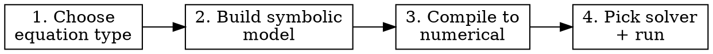
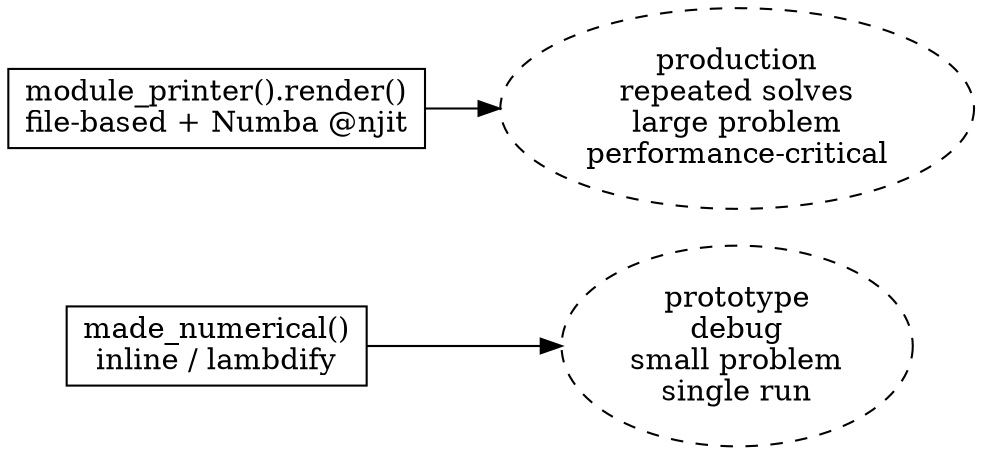

# Solverz Modeling

## What Solverz is

Solverz is a Python library for symbolic modeling + high-performance numerical solving of three equation types:

| Type | Math form | Use for |
|---|---|---|
| **AE** (Algebraic Equations) | $0 = F(y, p)$ | Power flow, heat flow, gas flow, steady-state |
| **DAE** (Differential-Algebraic Equations) | $M\dot{y} = F(t, y, p)$ | Dynamics with algebraic constraints (power systems, IES) |
| **FDAE** (Finite-Difference Algebraic Equations) | $0 = F(t, y, p, y_0)$ | PDE method-of-characteristics, MPC, fixed-step time stepping |

The user describes the model **symbolically** (sympy-flavored equations on `Var`, `Param`, `Eqn`, `Ode`), and Solverz generates either inline lambdified callables or a Numba-jit-compiled Python module. It provides built-in Newton / Rosenbrock / BDF solvers, but the generated `F(y, p)` and `J(y, p)` interfaces also let users plug in scipy or custom solvers.

**Authoritative URLs** (always link these, never `*.readthedocs.io`):
- Reference docs: <https://docs.solverz.org/>
- Cookbook (worked examples): <https://cookbook.solverz.org/latest/>

## When to use this skill

- The user says "Solverz", "Mat_Mul", "made_numerical", "module_printer", "nr_method", "sicnm", "Rodas", "ode15s", "fdae_solver", "TimeSeriesParam", "AliasVar", "DhsFlow", "PowerFlow", "SolMuseum", "SolUtil"
- The user wants to **build** a model (power flow, heat flow, gas pipeline, IES, custom AE/DAE)
- The user is hitting **Mat_Mul fallback warnings** and wants to fix them
- The user is debugging a Solverz model that **won't converge** or has a Jacobian shape mismatch
- The user asks "how do I declare a parameter / variable / equation in Solverz"
- The user wants to **pick a solver** for an AE / FDAE / DAE / ODE
- The user wants to use a **SolMuseum prebuilt block** (`gt`, `pv`, `st`, `eb`, `eps_network`, `heat_network`, `gas_network`)
- The user wants to **plot / extract** Solverz solver results (`sol.y`, `sol.T`, `sol.Y`, `sol.te`, `sol.ye`)

## The 4-step workflow



### Step 1: Choose the equation type

| If the user has... | The model is | Use solvers |
|---|---|---|
| Only `0 = F(y, p)` (no time, no derivatives) | **AE** | `nr_method`, `sicnm`, `continuous_nr`, `lm` |
| `dy/dt = f(t, y, p)` plus algebraic constraints | **DAE** | `Rodas`, `ode15s`, `backward_euler`, `implicit_trapezoid` |
| Discrete time stepping with explicit history `y_{k-1}` | **FDAE** | `fdae_solver` |
| Pure ODE (no algebraic constraints) | **DAE** (mass matrix is identity) | `Rodas`, `ode15s` |

`Model.create_instance()` **auto-detects** which one based on the equations declared. A model with `Ode(...)` becomes a `DAE`. A model with `AliasVar(...)` becomes an `FDAE`. Pure `Eqn(...)` model is an `AE`.

### Step 2: Build the symbolic model

```python
from Solverz import Model, Var, Param, Eqn, Ode

m = Model()                                   # 1. empty model
m.x = Var('x', value=[0.0, 0.0])              # 2. variables
m.A = Param('A', csc_matrix, dim=2, sparse=True)  # 3. parameters
m.b = Param('b', [1.0, 2.0])
m.eq = Eqn('eq', Mat_Mul(m.A, m.x) - m.b)     # 4. equations

eqs, y0 = m.create_instance()                 # 5. compile to symbolic IR
```

**Variable rules**:
- `Var(name, value)` — `name` is how it appears in expressions. `value` sets the initial guess **and** the variable length (so `Var('x', [0, 0, 0])` is a length-3 vector).
- Index with `m.x[0]`, `m.x[1:5]` (only `int` / `slice` recommended).
- Use sympy-like operators: `+ - * / **`. Functions: `sin`, `cos`, `exp`, `Abs`, `Sign`, `Diag`, `transpose`, `heaviside`, `Min`, etc.
- `AliasVar('x', init=m.x)` is the historical value of `m.x` from the previous time step (use only inside FDAE).

**Parameter rules**:
- `Param(name, value, dim=1, sparse=False, triggerable=False)`.
- `dim=2` + `sparse=True` declares a sparse matrix parameter for `Mat_Mul`. The matrix is **frozen at build time** — its sparsity pattern is decomposed into CSC arrays and used to assemble the Jacobian.
- `triggerable=True` lets the param be runtime-mutated via `trigger_fun(trigger_var)`.
- `TimeSeriesParam(name, v_series=[...], time_series=[...])` is a parameter that linearly interpolates between time nodes. Used for boundary conditions and fault scenarios in DAE/FDAE simulations.
- **Hard restriction**: a `Param(..., dim=2, sparse=True, triggerable=True)` and a `TimeSeriesParam(..., dim=2, sparse=True)` are **rejected at construction time**. CSC decomposition is frozen. Workaround: use `sparse=False` (slower, dense fallback) or rewrite the matrix element-by-element as scalar `Eqn`s with `TimeSeriesParam` coefficients.

**Equation rules**:
- `Eqn(name, expr)` represents `expr = 0`. Use the algebraic form: rearrange `lhs == rhs` to `lhs - rhs`.
- `Ode(name, f, diff_var)` represents `d(diff_var)/dt = f`. Use only inside a model that you want to be a DAE. Combine with `Eqn` for hybrid (rotor dynamics + network constraints).
- Equation names must be unique. For loops, build them with `m.__dict__[f'eq_{i}'] = Eqn(f'eq_{i}', ...)`.

**Matrix-vector equations (`Mat_Mul`)**: see the dedicated section below.

### Step 3: Compile to numerical

Two paths:



#### Inline mode — `made_numerical`

```python
from Solverz import made_numerical
mdl = made_numerical(eqs, y0,
                     sparse=True,           # Sparse Jacobian (almost always True)
                     output_code=False,     # Set True to return generated source as a string
                     make_hvp=False)        # Set True if you'll use sicnm
# mdl.F(y, p) → residual vector
# mdl.J(y, p) → Jacobian (sparse if sparse=True)
# mdl.p       → dict of parameter values, mutate at runtime via mdl.p['name'] = ...
```

When to use: prototyping, debugging, models that change between runs, anything where you don't want to write files to disk.

To inspect the generated code:
```python
mdl, code = made_numerical(eqs, y0, sparse=True, output_code=True)
print(code['F'])  # the F_(y_, p_) function
print(code['J'])  # the J_(y_, p_) function
```

#### Module printer mode — `module_printer`

```python
from Solverz import module_printer
printer = module_printer(eqs, y0,
                         name='mymodel',
                         directory='./codegen',
                         jit=True,         # Numba @njit on inner functions
                         make_hvp=True)    # Optional: also generate Hessian-vector product (for sicnm)
printer.render()                            # Writes ./codegen/mymodel/{num_func.py, param.py, setting.pkl, __init__.py}

# Re-import without going through the symbolic layer at all:
from codegen.mymodel import mdl, y as y0
# mdl.F(y, p)  → residual vector
# mdl.J(y, p)  → Jacobian (sparse if sparse=True at render)
# mdl.HVP(...) → Hessian-vector product (only if make_hvp=True)
# mdl.p        → parameter dict, mutable at runtime via mdl.p['name'] = ...
```

When to use: production, repeated solves, large models, anything you'll run more than a handful of times. The generated module is independent — once `render()` is done you don't need the symbolic layer or even Solverz's symbolic dependencies for `mdl.F` / `mdl.J` to work (only the runtime). First call pays the Numba compile cost (cached on disk).

**Re-render after every model change**: the module is frozen at render time. If you add a `Var`, change an `Eqn`, or modify a `Param`'s shape, call `render()` again — the previous module on disk is overwritten. There is no incremental rebuild.

Recommendation: **`jit=False` while debugging the model, then re-render with `jit=True` for production**. Numba compile errors are easier to diagnose against the pure-Python rendered code first.

### Step 4: Pick a solver and run

#### AE solvers

```python
from Solverz import nr_method, sicnm, Opt
sol = nr_method(mdl, y0, Opt(ite_tol=1e-8))
print(sol.y)              # Vars object — sol.y['x'], sol.y['e'], etc.
print(sol.stats.nstep)    # iteration count
```

| Solver | When to use |
|---|---|
| `nr_method` | Default. Pure Newton-Raphson. Fast when initial guess is good. |
| `sicnm` | Robust fallback for ill-conditioned AE. Requires `made_numerical(..., make_hvp=True)`. Pass `Opt(scheme='rodas4')` to pick the inner Rosenbrock scheme. |
| `continuous_nr` | Continuation-style NR — useful when NR diverges. |
| `lm` | scipy Levenberg-Marquardt fallback. Dense Jacobian only — slow. |

#### DAE / ODE solvers

```python
from Solverz import Rodas, Opt
import numpy as np
sol = Rodas(mdl,
            np.linspace(0, 10, 1001),  # tspan
            y0,
            Opt(rtol=1e-3, atol=1e-6, hinit=1e-5, event=event_fn))
print(sol.T)              # time vector
print(sol.Y['x'])         # state trajectory by variable name
print(sol.te, sol.ye, sol.ie)  # event times, states, indices
```

| Solver | When to use |
|---|---|
| `Rodas` | Default. Stiffly-accurate Rosenbrock with adaptive step, dense output, event detection. Set `Opt(scheme='rodas4'/'rodasp'/'rodas5p')`. |
| `ode15s` | MATLAB-compatible BDF multistep. Very stiff systems. |
| `backward_euler`, `implicit_trapezoid` | Single-step implicit, fixed step. Use when you want a known step size. |

#### FDAE solver

```python
from Solverz import fdae_solver, Opt
sol = fdae_solver(mdl, [0, T], y0, Opt(step_size=dt))
```

#### Events (DAE only)

```python
def events(t, y):
    value = np.array([y[0]])      # event triggers when this crosses zero
    isterminal = np.array([1])    # 1 = stop solver on this event
    direction = np.array([-1])    # -1 = only on negative-direction crossing
    return value, isterminal, direction

sol = Rodas(mdl, np.linspace(0, 30, 100), y0, Opt(event=events))
```

#### Mutating parameters at runtime

```python
mdl.p['t'] = np.array([1.0])  # any param can be re-assigned in mdl.p
sol = nr_method(mdl, sol.y)   # re-solve with new parameter
```

## Matrix-vector equations: `Mat_Mul`

Use `Mat_Mul(A, x)` for matrix-vector products inside an `Eqn`. The matrix parameter must be `dim=2, sparse=True`:

```python
from Solverz import Mat_Mul
m.A = Param('A', sparse_csc_array, dim=2, sparse=True)
m.x = Var('x', np.zeros(n))
m.b = Param('b', rhs)
m.eq = Eqn('eq', Mat_Mul(m.A, m.x) - m.b)
```

Solverz computes the symbolic Jacobian via matrix calculus and emits a `SolCF.csc_matvec` call (the **fast path**) inside the generated `inner_F` for `Mat_Mul(A, x)` placeholders where `A` is a bare sparse `dim=2` `Param`.

**Fast-path conditions** (all required):
- `A` is a `Param`, not an expression
- `A` is `dim=2, sparse=True`
- The operand is a vector expression with no embedded `Mat_Mul`, no embedded sparse `dim=2` `Param`

**Fallback path** (slower, scipy SpMV per call): triggered by anything else. Solverz emits a `UserWarning` with the placeholder name + the offending matrix expression + a suggested rewrite.

| If you wrote… | Rewrite as… |
|---|---|
| `Mat_Mul(-A, x)` | `-Mat_Mul(A, x)` |
| `Mat_Mul(2*A, x)` | `2 * Mat_Mul(A, x)` |
| `Mat_Mul(A + B, x)` | `Mat_Mul(A, x) + Mat_Mul(B, x)` |
| `Mat_Mul(A.T, x)` | predeclare `m.A_T = Param('A_T', A.T, dim=2, sparse=True)` |
| `Mat_Mul(A, B, x)` (multi-arg fold) | `Mat_Mul(A, Mat_Mul(B, x))` (explicit two-level nesting) |

`MatVecMul` is the **deprecated** legacy interface — new code should always use `Mat_Mul`. The deprecation warning is harmless but you should migrate.

For full matrix calculus details (fast / fallback path internals, mutable Jacobian scatter-add, performance numbers) see the canonical reference: <https://docs.solverz.org/matrix_calculus.html>

## Common pitfalls

| Symptom | Cause | Fix |
|---|---|---|
| `Equation size and variable size not equal!` warning | `#equations ≠ #variables` after `create_instance()` | Add missing `Eqn` or `Var`; check loop ranges |
| `Inconsistent initial values for algebraic equation: {name}` | DAE algebraic constraints not satisfied at `t=0` | Pre-solve the AE part for `y0`, then start the DAE integration |
| `Parameter {name} is a dense 2-D Param ... falls back to slower path` | Used `Param(..., dim=2, sparse=False)` inside `Mat_Mul` | Declare with `sparse=True` (and pass a `csc_array` value) |
| `NotImplementedError: time-varying sparse matrices unsupported` | `Param(..., dim=2, sparse=True, triggerable=True)` or `TimeSeriesParam(..., dim=2, sparse=True)` | Use `sparse=False` (dense) or rewrite element-wise as scalar `Eqn`s with `TimeSeriesParam` coefficients |
| `Mat_Mul placeholder ... falls back to scipy.sparse SpMV` | One of the fallback shapes above | See the rewrite table in the Mat_Mul section |
| Numba compile errors deep in `inner_F` | `triggerable=True` or sparse `TimeSeriesParam` is in the inner argument list | Set `jit=False` to debug; consider declaring the offending param `sparse=False` |
| Solver hangs in `nr_method` | Bad initial guess, ill-conditioned Jacobian | Try `sicnm` (with `make_hvp=True`); use `continuous_nr`; provide better `y0` |
| `Rodas` fails on first step | DAE index > 1, or stiff transient | Reduce `Opt(hinit=...)`, increase `rtol`/`atol`, check Jacobian sign |
| Extracting solution: `sol.y['name']` vs `sol.Y['name']` confusion | AE solvers return `sol.y` (single solution); DAE solvers return `sol.Y` (trajectory) and `sol.T` | See "Pick a solver" tables for which solver returns what |

## Where to find examples

This skill bundles canonical end-to-end snippets:

- **`references/examples/bouncing-ball.md`** — Minimal DAE with event handling. Start here if you've never used Solverz.
- **`references/examples/power-flow.md`** — Canonical AE with `Mat_Mul` and sparse Jacobian (case30 power flow, the cookbook chapter form).
- **`references/examples/heat-flow.md`** — Canonical AE with **mutable-matrix Jacobian** (loop pressure drop with `Diag(K * m * |m|)`).
- **`references/examples/m3b9-dynamics.md`** — Canonical DAE: synchronous machine dynamics with `TimeSeriesParam` for fault events, solved with `Rodas`.
- **`references/examples/gas-characteristics.md`** — Canonical FDAE: gas pipeline by method of characteristics with `AliasVar` for previous-step state.

For deeper coverage:

- **`references/api-reference.md`** — Full signatures of `Model`, `Var`, `Param`, `Eqn`, `Ode`, `made_numerical`, `module_printer`, every solver, `Opt` options dict.
- **`references/ecosystem.md`** — Chapter list of the Solverz Cookbook + every reusable block in SolMuseum (`gt`, `pv`, `st`, `eb`, `eps_network`, `heat_network`, `gas_network`) + every helper in SolUtil (`PowerFlow`, `DhsFlow`, `GasFlow`).

## Quick reference card

```python
# === BUILD ===
m = Model()
m.x = Var('x', [0.0, 0.0])
m.A = Param('A', csc_array, dim=2, sparse=True)
m.b = Param('b', [1.0, 2.0])
m.eq = Eqn('eq', Mat_Mul(m.A, m.x) - m.b)
eqs, y0 = m.create_instance()

# === COMPILE (pick one) ===
mdl = made_numerical(eqs, y0, sparse=True)                          # inline
# OR
module_printer(eqs, y0, 'mymodel', directory='out', jit=True).render()  # module mode

# === SOLVE ===
sol = nr_method(mdl, y0, Opt(ite_tol=1e-8))                         # AE
sol = Rodas(mdl, np.linspace(0, T, n), y0, Opt(rtol=1e-3))          # DAE
sol = fdae_solver(mdl, [0, T], y0, Opt(step_size=dt))               # FDAE

# === EXTRACT ===
sol.y['x']      # AE: solution by variable name
sol.Y['x']      # DAE: trajectory (n_t × n_var)
sol.T           # DAE: time vector
sol.te, sol.ye, sol.ie  # event times, states, indices
sol.stats.nstep, sol.stats.nfeval, sol.stats.nJeval  # diagnostics
```

## Out of scope

- **Extending Solverz with custom symbolic functions** — see `https://docs.solverz.org/advanced.html` and `extend_matrix_calculus.md` in the Solverz repo.
- **Writing your own solver against `mdl.F` / `mdl.J`** — Solverz exposes the numerical interface deliberately so users can plug in scipy or custom solvers; the README has a 20-line NR example.
- **Internals of the code printer / matrix calculus engine** — that's contributor territory, not user-modeling territory.
