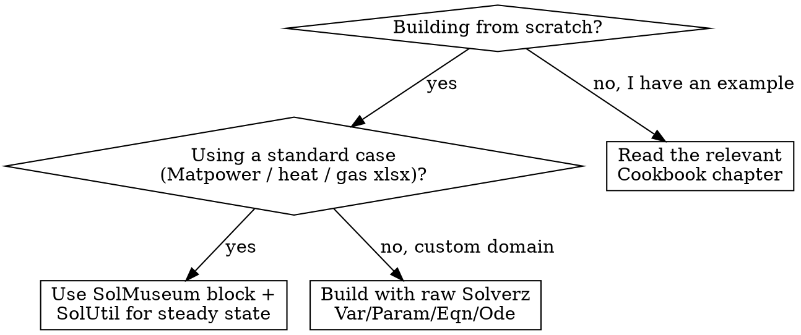

# Solverz Ecosystem Map

The Solverz ecosystem is split across four repositories. Each one fills a different niche.

| Repo | URL | Role |
|---|---|---|
| **Solverz** (core) | <https://github.com/smallbunnies/Solverz> | Symbolic modeling layer + numerical code printer + built-in solvers |
| **Solverz Cookbook** | <https://github.com/rzyu45/Solverz-Cookbook> (rendered: <https://cookbook.solverz.org/latest/>) | Worked examples per equation type with full code |
| **SolMuseum** | <https://github.com/rzyu45/SolMuseum> | Reusable model building blocks (power, heat, gas, IES devices) |
| **SolUtil** | <https://github.com/rzyu45/SolUtil> | Steady-state energy-flow solvers (PowerFlow / DhsFlow / GasFlow) used to bootstrap initial conditions |

## How they fit together

For most non-trivial modeling tasks the user combines all four:

1. **SolUtil** loads a case file (`.xlsx`, Matpower `.m`, etc.) and runs the steady-state solve. Result: known operating point (`Vm`, `Va`, `Pg`, `Qg`, mass flows, temperatures, gas pressures).
2. **SolMuseum** wraps that operating point in a prebuilt device model (`gt`, `pv`, `eb`, `eps_network`, `heat_network`, etc.) — this saves the user from writing the equations from scratch.
3. **Solverz** core composes the device models into a single `Model()`, generates the numerical code, and runs the solver.
4. **Cookbook** examples show the full pipeline end-to-end for the canonical use cases.

## Solverz Cookbook chapters

Source tree: `/docs/source/{ae,dae,fdae}/<chapter>/<chapter>.md` with code in `<chapter>/src/`.

### AE chapters

| Chapter | File | Domain | Solver(s) | What it teaches |
|---|---|---|---|---|
| **Power flow** | `ae/pf/pf.md` | Electrical power systems (case30) | `nr_method`, `sicnm` | Two formulations of the same problem: scalar for-loop (classic) and `Mat_Mul` matrix-vector (modern). Power-flow Mat_Mul vs polar performance comparison. The canonical AE example. Also demonstrates `make_hvp=True` for `sicnm`. |
| **Heat flow** | `ae/heat_flow/heat_flow.md` | District heating hydraulics | `nr_method` | Mass continuity + nonlinear loop pressure drop. Demonstrates **mutable-matrix Jacobian** (`Diag(K * m * Abs(m))`) — the scatter-add code path. Two formulations: element-wise and `Mat_Mul`. |
| **Ill-conditioned PF** | `ae/ill_pf/ill_pf.md` | Power flow (ill-conditioned cases) | `sicnm` | When `nr_method` diverges, switch to `sicnm` with `make_hvp=True`. |

### DAE chapters

| Chapter | File | Domain | Solver(s) | What it teaches |
|---|---|---|---|---|
| **M3B9** | `dae/m3b9/m3b9.md` | 3-machine-9-bus power system dynamics | `Rodas` | Coupled rotor ODEs + algebraic network equations. Uses `TimeSeriesParam` for fault scenarios (`G66` impedance surge). Canonical small DAE. |
| **Integrated Energy System (IES)** | `dae/ies/ies.md` | Combined power + heat + gas + devices | `Rodas` | Composing multiple SolMuseum blocks (`gt`, `pv`, `st`, `eb`, `eps_network`, `heat_network`, `gas_network`) into one model. Uses `model.add(...)` to merge sub-models. Real-world scale. |
| **Heat flow dynamics** | `dae/heat_flow_dynamic/heat_flow_dynamic.md` | DHS transients | `Rodas` | PDE-discretized heat propagation in pipes (KT2 method). Shows pipe-temperature distribution variables. |

### FDAE chapters

| Chapter | File | Domain | Solver | What it teaches |
|---|---|---|---|---|
| **Gas pipeline characteristics** | `fdae/cha/cha.md` | Isothermal gas transmission (1D PDE) | `fdae_solver` | Method of characteristics (MOC) discretization. Uses `AliasVar('p', init=m.p)` for previous-time-step state. Canonical FDAE pattern for hyperbolic PDEs. |

## SolMuseum building blocks

Source tree: `SolMuseum/{ae,dae,pde}/<module>.py`. Import via `from SolMuseum.ae import ...` or `from SolMuseum.dae import ...`.

### AE blocks (`SolMuseum.ae`)

| Block | Constructor | Purpose | Typical use |
|---|---|---|---|
| `eps_network` | `eps_network(pf: PowerFlow)` | Power-flow network equations (static or dynamic) | `m.add(eps_network(pf).mdl(dyn=False))` for static, `dyn=True` for current-voltage rectangular form |
| `eb` | `eb(eta=, vm0=, phi=, ux=, uy=, ...)` | Energy buffer / battery | `m.add(eb(...).mdl())` |
| `p2g` | `p2g(...)` | Power-to-gas (electrolyser) | Couples power and gas networks |

### DAE blocks (`SolMuseum.dae`)

| Block | Constructor | Purpose |
|---|---|---|
| `gt` | `gt(ux=, uy=, ix=, iy=, ra=, xdp=, xqp=, xq=, Damping=, Tj=, ...)` | Gas turbine generator with governor + exciter |
| `st` | `st(ux=, uy=, ix=, iy=, ra=, xdp=, xqp=, ...)` | Steam turbine generator |
| `pv` | `pv(ux=, uy=, ix=, iy=, kop=, koi=, ws=, lf=, ...)` | Photovoltaic inverter (grid-forming) |
| `heat_network` | `heat_network(df: DhsFlow).mdl(dx=, dt=, method=)` | District heating dynamics (mass + thermal coupled) |
| `gas_network` | `gas_network(gf: GasFlow).mdl(dx=, dt=)` | Gas transmission dynamics |

### PDE helpers (`SolMuseum.pde`)

| Helper | Purpose |
|---|---|
| `SolMuseum.pde.heat` | Discretization helpers for 1D heat conduction PDEs |
| `SolMuseum.pde.gas` | Discretization helpers for 1D isothermal gas flow (MOC, WENO3) |

### Composition pattern

Every SolMuseum block exposes a `.mdl()` method that returns a Solverz `Model()` snippet. Combine them with `model.add(...)`:

```python
from Solverz import Model, Rodas, Opt, made_numerical
from SolMuseum.dae import gt, pv, heat_network
from SolMuseum.ae import eps_network
from SolUtil import PowerFlow, DhsFlow

# 1. Steady-state initial conditions
pf = PowerFlow("case.xlsx"); pf.run()
df = DhsFlow("heat_case.xlsx"); df.run()

# 2. Compose
model = Model()
model.add(gt(ux=pf.ux[0], uy=pf.uy[0], ix=pf.ix[0], iy=pf.iy[0], ...).mdl())
model.add(pv(ux=pf.ux[1], uy=pf.uy[1], ...).mdl())
model.add(eps_network(pf).mdl(dyn=True))
model.add(heat_network(df).mdl(dx=100, dt=0, method='kt2'))

# 3. Solve
spf, y0 = model.create_instance()
mdl = made_numerical(spf, y0, sparse=True)
sol = Rodas(mdl, np.linspace(0, 10, 1001), y0, Opt(hinit=1e-5))
```

## SolUtil helpers

Source tree: `SolUtil/{energyflow, sysparser, ...}/`. Import via `from SolUtil import ...`.

### Steady-state solvers

| Class | Purpose | Key method | Result attributes |
|---|---|---|---|
| `PowerFlow(file)` | Power-flow Newton-Raphson on a Matpower / xlsx case | `.run()` | `.Vm`, `.Va`, `.Pg`, `.Qg`, `.Pd`, `.Qd`, `.Ybus`, `.Gbus`, `.Bbus`, `.idx_slack`, `.idx_pv`, `.idx_pq`, `.U`, `.S`, `.ux`, `.uy`, `.ix`, `.iy` |
| `DhsFlow(file)` | District heating steady state (alternates IPOPT hydraulic + Solverz thermal) | `.run(tee=True)` | `.m`, `.minset`, `.Ts`, `.Tr`, `.phi`, `.K`, `.S`, `.L`, `.lam`, `.n_node`, `.n_pipe`, `.G` (networkx) |
| `GasFlow(file)` | Gas-flow steady state via Pyomo / IPOPT | `.run()` | Gas pressure, mass flow per pipe |
| `DhsFaultFlow(file)` | DHS variant for pipe rupture / fault scenarios | `.run()` | Same as `DhsFlow` plus fault state |

### File loaders (`SolUtil.sysparser`)

| Function | Purpose |
|---|---|
| `load_mpc(file)` | Load Matpower `.m` or `.xlsx` power case |
| `load_hs(file)` | Load heat case `.xlsx` |
| `load_gs(file)` | Load gas case `.xlsx` |

### Other helpers

| Function | Purpose |
|---|---|
| `calrmse(a, b)` | RMSE between two numpy arrays |
| `TimeProf` | Lightweight timing context manager |

### Canonical idiom

```python
from SolUtil import PowerFlow

pf = PowerFlow("case30.xlsx")
pf.run()
print(pf.Vm)            # voltage magnitudes
print(pf.Va)            # voltage angles (rad)
print(pf.ux + 1j*pf.uy) # complex voltage
```

## Choosing where to start



| Situation | Where to start |
|---|---|
| First time using Solverz | `examples/bouncing-ball.md` (minimal DAE) |
| Power flow on Matpower case | `examples/power-flow.md` + `SolUtil.PowerFlow` |
| Heat flow with mutable Jacobian | `examples/heat-flow.md` + `SolUtil.DhsFlow` |
| Power system dynamics (rotor + network) | `examples/m3b9-dynamics.md` + `Rodas` |
| Gas pipeline transient | `examples/gas-characteristics.md` + `fdae_solver` |
| Combined integrated energy system | Cookbook `dae/ies/ies.md` (uses every SolMuseum block) |
| Custom domain (chemistry, mechanics, etc.) | Build from raw Solverz primitives — see `SKILL.md` step-by-step workflow |
