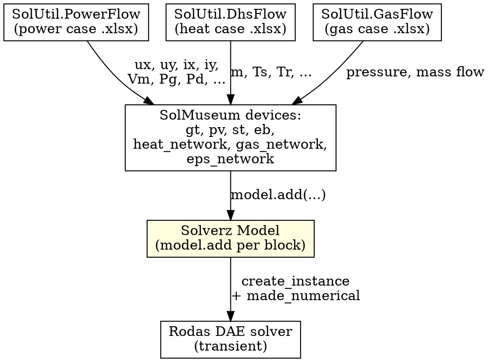

# Example: Integrated Energy System (DAE composition with SolUtil + SolMuseum)

**What this teaches**: How to compose a realistic multi-domain dynamic simulation from prebuilt blocks — `SolUtil`'s steady-state flow solvers (`PowerFlow`, `DhsFlow`, `GasFlow`) for initial conditions, plus `SolMuseum`'s prebuilt DAE devices (`gt`, `pv`, `st`, `eb`, `eps_network`, `heat_network`, `gas_network`) wired together with `model.add(...)`. **No equation-by-equation assembly** — every domain block ships its own equations and the user just plugs them together.

**Why this is canonical**: It's the only end-to-end example in this skill that actually shows how to *use* the `SolUtil` + `SolMuseum` halves of the ecosystem in production. The other 5 examples (bouncing ball / power flow / heat flow / M3B9 / gas characteristics) all hand-write the equations from raw `Var` / `Param` / `Eqn` / `Ode` primitives. Once you go past toy problems, you almost never want to do that for power / heat / gas — the museum blocks are already debugged and the steady-state solvers handle case file parsing for you.

**Solver**: `Rodas` with `Opt(hinit=1e-5)` to clamp the initial step (devices have tight time constants).

## The big picture



The pattern is always the same: **steady state → device assembly → DAE solve**. Each `SolMuseum` device takes the steady-state operating point as its initial condition and contributes its own ODEs/equations to the combined model.

## Code

```python
import numpy as np
from Solverz import Model, Opt, Rodas, made_numerical
from SolMuseum.ae import eps_network, eb
from SolMuseum.dae import gt, pv, st, heat_network, gas_network
from SolUtil import PowerFlow, DhsFlow, GasFlow


# === 1. Steady-state initial conditions from SolUtil ========================
# Each *Flow class loads its case file (.xlsx / Matpower .mat), runs its own
# steady-state solver internally, and exposes the converged operating point
# as ordinary numpy attributes you can read directly.

pf = PowerFlow("test_ies/caseI.xlsx")
pf.run()
# pf.Vm, pf.Va     — voltage magnitudes (pu) and angles (rad)
# pf.Pg, pf.Qg     — generation (pu)
# pf.Pd, pf.Qd     — loads (pu)
# pf.Ybus          — complex admittance (sparse)
# pf.idx_slack/pv/pq — bus classification

df = DhsFlow("test_ies/case_heat.xlsx")
df.run()
# df.m             — pipe mass flows
# df.minset        — node injections
# df.Ts, df.Tr     — supply / return temperatures
# df.G             — networkx DiGraph topology

gf = GasFlow("test_ies/case_gas.xlsx")
gf.run()
# gf attributes — pressure, mass flow per pipe

# === 2. Derive complex voltage / current at each bus ========================
# SolMuseum DAE devices use rectangular coordinates (ux + j uy / ix + j iy),
# so we convert from the polar form that PowerFlow returns.

voltage = pf.Vm * np.exp(1j * pf.Va)
power   = (pf.Pg - pf.Pd) + 1j * (pf.Qg - pf.Qd)
current = (power / voltage).conjugate()
ux, uy = voltage.real, voltage.imag
ix, iy = current.real, current.imag


# === 3. Compose the dynamic model with model.add(...) =======================
# Every museum block exposes a .mdl() method that returns a Model fragment.
# Wire them together by calling model.add() — Solverz merges them into one
# global symbolic model behind the scenes.

model = Model()

# --- Synchronous gas turbine at bus 0 (one of many SolMuseum dynamic devices) ---
gt_0 = gt(
    # Network coupling (bus the device is sitting on):
    ux=ux[0], uy=uy[0], ix=ix[0], iy=iy[0],
    # Machine reactances (per-unit):
    ra=0, xdp=0.0608, xqp=0.0969, xq=0.0969,
    # Mechanical:
    Damping=10, Tj=47.28,
    # Governor / fuel system / exciter — see SolMuseum.dae.gt for the full list:
    A=-0.158, B=1.158, C=0.5, D=0.5, E=313, W=320,
    kp=0.11, ki=1/30, K1=0.85, K2=0.15,
    TRbase=800, wref=1, qmin=-0.13, qmax=1.5,
    T1=12.2, T2=1.7, TCD=0.16, TG=0.05, b=0.04,
    TFS=1000, Tref=900.3144, c=1e8,
)
model.add(gt_0.mdl())

# --- PV inverter at bus 1 ---
pv_1 = pv(
    ux=ux[1], uy=uy[1], ix=ix[1], iy=iy[1],
    kop=-0.05, koi=-10, ws=376.99, lf=0.005, kip=2, kii=9,
    Pnom=26813.04395522,
    # ... DC-side controller + PV cell parameters omitted for brevity;
    # see SolMuseum.dae.pv for the full constructor signature
)
model.add(pv_1.mdl())

# --- Steam turbine at bus 2 ---
z, eta, f_steam = 1e-8, 1, 1.02775712
st_2 = st(
    ux=ux[2], uy=uy[2], ix=ix[2], iy=iy[2],
    ra=0, xdp=0.0608, xqp=0.1200,
    Damping=5, Tj=6, A=0.5, B=0.5,
    TRbase=800, wref=1, T1=0.3, T2=10, TCD=0.16, TG=0.04, b=0.05,
    Tref=800, phi=(eta * f_steam - pf.Pg[2]) / z, z=z,
)
model.add(st_2.mdl())

# --- Energy buffer (battery) at bus 5 ---
eb_5 = eb(
    eta=1, vm0=pf.Vm[5], phi=pf.Pd[5] * pf.baseMVA * 1e6,
    ux=ux[5], uy=uy[5],
    epsbase=pf.baseMVA * 1e6,
    pd=pf.Pd[5], pd0=pf.Pd[5],
)
model.add(eb_5.mdl())

# --- Heat network (district heating dynamics) ---
# heat_network reads its topology + initial state from the DhsFlow object.
hn = heat_network(df)
model.add(hn.mdl(dx=100, dt=0, method='kt2'))

# --- Gas network (transmission dynamics) ---
gn = gas_network(gf)
model.add(gn.mdl(dx=200, dt=0))

# --- Electrical network coupling (algebraic injections at every bus) ---
# eps_network with dyn=True emits the rectangular-coordinate current-balance
# equations that link every dynamic device above to the network admittance.
net = eps_network(pf)
model.add(net.mdl(dyn=True))


# === 4. Compile + simulate ==================================================
spf, y0 = model.create_instance()                          # auto-detected as DAE
mdl = made_numerical(spf, y0, sparse=True)

sol = Rodas(
    mdl,
    np.linspace(0, 10, 1001),                              # 10 s, 1 ms output step
    y0,
    Opt(hinit=1e-5),                                       # clamp first step (stiff)
)

# === 5. Extract trajectories by variable name ===============================
import matplotlib.pyplot as plt
plt.plot(sol.T, sol.Y['omega'])                            # rotor speeds
plt.xlabel('Time / s'); plt.ylabel('Rotor speed (pu)')
plt.show()
```

## Notes

- **`model.add(block.mdl())` is the universal composition pattern.** Each `SolMuseum` device class is constructed with its operating-point parameters (currents/voltages from `SolUtil`, plus device-specific physical constants), then `.mdl()` returns the symbolic fragment that gets merged into the global `Model`. There is no manual equation copying.
- **Steady state is necessary** — DAE solvers need consistent initial conditions for the algebraic constraints. The whole point of running `pf.run()` / `df.run()` / `gf.run()` first is to get those for free.
- **Polar → rectangular conversion** happens once at the start, then every dynamic device receives `ux`/`uy`/`ix`/`iy` instead of `Vm`/`Va`/`P`/`Q`. Solverz's matrix-calculus engine handles rectangular coordinates more naturally (no transcendental nesting in the Jacobian).
- **`eps_network(pf).mdl(dyn=True)`** is the *coupling* block — it emits one current-balance equation per non-slack bus, linking the per-device current injections (`ix`, `iy` from each `gt` / `pv` / `st` / `eb`) to the network admittance matrix. Without this block the dynamic devices would be islands.
- **`Opt(hinit=1e-5)`** is a stiff-system safety net. Devices like `gt` and `pv` have controller time constants in the millisecond range; without `hinit`, Rodas's automatic initial-step heuristic might pick `h ≈ 0.01s` and miss the fast transient on the first step.
- **`make_hvp=False` is fine here** — `Rodas` doesn't need the Hessian-vector product. Only `sicnm` needs it (and you wouldn't use `sicnm` for a DAE simulation).
- **Adding a new device** is a 3-line change: import the museum class, instantiate it with the bus's operating point, call `model.add(...)`. No global edits anywhere else.

## Where to find the device parameters

The `gt` / `pv` / `st` / `eb` constructors take ~20 parameters each — too many to memorise. The complete signatures with units and physical meaning live in:

- `SolMuseum/dae/gt.py` — gas turbine (governor + exciter + machine)
- `SolMuseum/dae/pv.py` — photovoltaic inverter (DC + AC sides + grid coupling)
- `SolMuseum/dae/st.py` — steam turbine
- `SolMuseum/ae/eb.py` — energy buffer / battery

The cookbook IES chapter (`docs/source/dae/ies/ies.md`) has the parameter values for the canonical `caseI.xlsx` benchmark — start from those when you build your own model and tweak from there.

## See also

- Cookbook chapter (full discussion): `Solverz-Cookbook/docs/source/dae/ies/ies.md`
- For a single-machine DAE without museum blocks (everything written by hand), see `examples/m3b9-dynamics.md`
- For the SolMuseum block list and SolUtil helper list with file paths, see `references/ecosystem.md`
- Matrix calculus internals (why rectangular coordinates are preferred): <https://docs.solverz.org/matrix_calculus.html>
