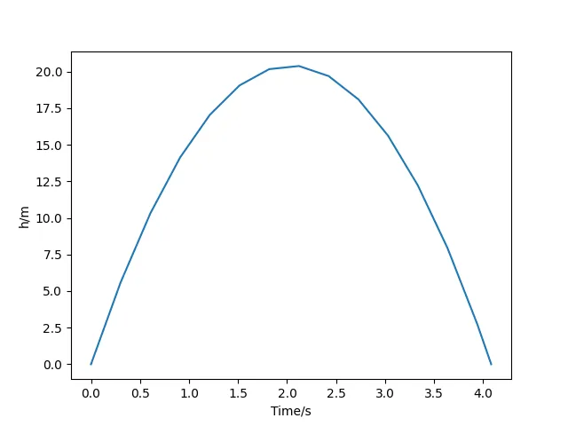

# Overview
Solverz is an open-source python-based simulation modelling language that provides symbolic interfaces for you to model your equations and can then generate functions or numba-jitted python modules for numerical solutions. 

Solverz supports three types of abstract equation types, that are

- Algebraic Equations (AEs) $0=F(y,p)$
- Finite Difference Algebraic Equations (FDAEs) $0=F(y,p,y_0)$
- Differential Algebraic Equations (DAEs) $M\dot{y}=F(t,y,p)$

where $p$ is the parameter set of your models, $y_0$ is the previous time node value of $y$.

Say, we want to know how long it will take for an apple, launched from the ground into the air, to fall back to the
ground. We have the differential equations 

$$
\begin{aligned}
&v'=-9.8\\
&h'=v
\end{aligned}
$$ 

with $v(0)=20$ and $h(0)=0$, we can just type the codes
```python
import matplotlib.pyplot as plt
import numpy as np
from Solverz import Model, Var, Ode, Opt, made_numerical, Rodas

# Declare a simulation model
m = Model()
# Declare variables and equations
m.h = Var('h', 0)
m.v = Var('v', 20)
m.f1 = Ode('f1', f=m.v, diff_var=m.h)
m.f2 = Ode('f2', f=-9.8, diff_var=m.v)
# Create the symbolic equation instance and the variable combination 
bball, y0 = m.create_instance()
# Transform symbolic equations to python numerical functions.
nbball = made_numerical(bball, y0, sparse=True)

# Define events, that is,  if the apple hits the ground then the simulation will cease.
def events(t, y):
    value = np.array([y[0]]) 
    isterminal = np.array([1]) 
    direction = np.array([-1]) 
    return value, isterminal, direction

# Solve the DAE
sol = Rodas(nbball,
            np.linspace(0, 30, 100), 
            y0, 
            Opt(event=events))

# Visualize
plt.plot(sol.T, sol.Y['h'][:, 0])
plt.xlabel('Time/s')
plt.ylabel('h/m')
plt.show()
```
Then we have



The model is solved with the stiffly accurate Rosenbrock type method, but you can also write your own solvers by the generated numerical interfaces since, for example, the Newton-Raphson solver implememtation for AEs is as simple as below.
```python
@ae_io_parser
def nr_method(eqn: nAE,
              y: np.ndarray,
              opt: Opt = None):
    if opt is None:
        opt = Opt(ite_tol=1e-8)

    tol = opt.ite_tol
    p = eqn.p
    df = eqn.F(y, p)
    ite = 0
    # main loop
    while max(abs(df)) > tol:
        ite = ite + 1
        y = y - solve(eqn.J(y, p), df)
        df = eqn.F(y, p)
        if ite >= 100:
            print(f"Cannot converge within 100 iterations. Deviation: {max(abs(df))}!")
            break

    return aesol(y, ite)
```
The implementation of the NR solver just resembles the formulae you read in any numerical analysis book. This is because the numerical AE object `eqn` provides the $F(t,y,p)$ interface and its Jacobian $J(t,y,p)$, which is derived by symbolic differentiation. 

Sometimes you have very complex models and you dont want to re-derive them everytime. With Solverz, you can just use
```python
from Solverz import module_printer

pyprinter = module_printer(bball,
                           y0,
                           'bounceball',
                           jit=True)
pyprinter.render()
```
to generate an independent python module of your simulation models. You can import them to your .py file by

```python
from bounceball import mdl as nbball, y as y0
```

# Installation

Solverz requires ```python>=3.10```, and can be installed locally with

```shell
pip install Solverz
```

# Useful Resources

- [Solverz Documentation](https://doc.solverz.org)
- [Solverz Cookbook](https://cook.solverz.org)

 
