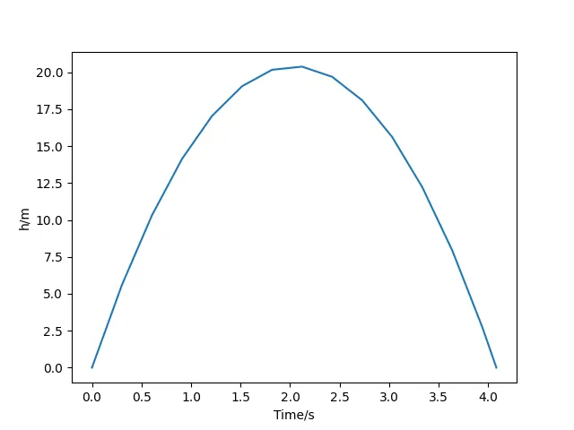

<p align="center">
  <picture>
    <source media="(prefers-color-scheme: dark)" srcset="docs/src/_static/brand/logo-horizontal-dark.png">
    
  </picture>
</p>

<p align="center">
  <a href="https://docs.solverz.org/">Documentation</a> ·
  <a href="https://cookbook.solverz.org/latest/">Cookbook</a> ·
  <a href="https://docs.solverz.org/reference/index.html">API reference</a> ·
  <a href="https://pypi.org/project/Solverz/">PyPI</a>
</p>

Solverz is an open-source, general-purpose modeling and simulation toolkit for Python. Define symbolic equations, generate numerical functions or compiled Python modules, and solve your models through a consistent interface.

## Installation

Solverz requires Python 3.10 or later.

```shell
pip install Solverz
```

## Model types

Solverz supports three equation types.

- Algebraic Equations (AEs) $0=F(y,p)$
- Finite Difference Algebraic Equations (FDAEs) $0=F(y,p,y_0)$
- Differential Algebraic Equations (DAEs) $M\dot{y}=F(t,y,p)$

where $p$ is the parameter set of your models, $y_0$ is the previous time node value of $y$.

## A first simulation

The following example models an object launched vertically from the ground. Its velocity and height satisfy

$$
\begin{aligned}
&v'=-9.8\\
&h'=v
\end{aligned}
$$

with $v(0)=20$ and $h(0)=0$, we can just type the codes
```python
import matplotlib.pyplot as plt
import numpy as np
from Solverz import Model, Var, Ode, Opt, made_numerical, Rodas

# Declare a simulation model
m = Model()
# Declare variables and equations
m.h = Var('h', 0)
m.v = Var('v', 20)
m.f1 = Ode('f1', f=m.v, diff_var=m.h)
m.f2 = Ode('f2', f=-9.8, diff_var=m.v)
# Create the symbolic equation instance and the variable combination 
bball, y0 = m.create_instance()
# Transform symbolic equations to python numerical functions.
nbball = made_numerical(bball, y0, sparse=True)

# Define events, that is,  if the apple hits the ground then the simulation will cease.
def events(t, y):
    value = np.array([y[0]]) 
    isterminal = np.array([1]) 
    direction = np.array([-1]) 
    return value, isterminal, direction

# Solve the DAE
sol = Rodas(nbball,
            np.linspace(0, 30, 100), 
            y0, 
            Opt(event=events))

# Visualize
plt.plot(sol.T, sol.Y['h'][:, 0])
plt.xlabel('Time/s')
plt.ylabel('h/m')
plt.show()
```
The result is



## Use the numerical interface

The example uses a Rosenbrock method. Solverz also exposes numerical functions for custom solvers. The following Newton–Raphson implementation solves algebraic equations.
```python
@ae_io_parser
def nr_method(eqn: nAE,
              y: np.ndarray,
              opt: Opt = None):
    if opt is None:
        opt = Opt(ite_tol=1e-8)

    tol = opt.ite_tol
    p = eqn.p
    df = eqn.F(y, p)
    ite = 0
    # main loop
    while max(abs(df)) > tol:
        ite = ite + 1
        y = y - solve(eqn.J(y, p), df)
        df = eqn.F(y, p)
        if ite >= 100:
            print(f"Cannot converge within 100 iterations. Deviation: {max(abs(df))}!")
            break

    return aesol(y, ite)
```
The implementation of the NR solver just resembles the formulae you read in any numerical analysis book. This is because the numerical AE object `eqn` provides the $F(t,y,p)$ interface and its Jacobian $J(t,y,p)$, which is derived by symbolic differentiation.

## Generate a reusable module

Save a model as an independent Python module when you need to reuse it.
```python
from Solverz import module_printer

pyprinter = module_printer(bball,
                           y0,
                           'bounceball',
                           jit=True)
pyprinter.render()
```
Import the generated model with

```python
from bounceball import mdl as nbball, y as y0
```

## Resources

- [Solverz Documentation](https://docs.solverz.org)
- [Solverz Cookbook](https://cookbook.solverz.org/latest/)
- [Solverz Museum](https://solmuseum.solverz.org)
- [Brand assets](docs/src/_static/brand/README.md)

## Cite Solverz

### Chinese

 [1] 俞睿智,顾伟,陆帅,张苏涵,徐一骏.面向综合能源系统的开源高性能仿真建模工具开发[J].中国电机工程学报,2026,46(9):3654-3665.DOI:10.13334/j.0258-8013.pcsee.242788.

### English

 [1] R. Yu, W. Gu, S. Lu, S. Zhang, Y. Xu and R. Wang, "Efficient and Generic Co-simulation Framework for Integrated Energy Systems with Renewable Energy Penetration," 2026 IEEE PES International Meeting (PES IM), Hong Kong, Hong Kong, 2026, pp. 1-5, doi: 10.1109/PESIM67009.2026.11439048.


 
